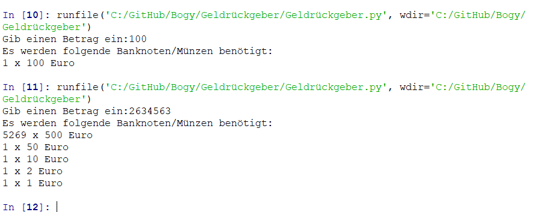

# Geldrückgeber
Dieses Pythonprogramm gibt bei Rückgeld aus, welche Banknoten benötigt werden, um das entsprechende Rückgeld ausgeben zu können.
## Inahltsverzeichnis

- [Geldrückgeber](#geldrückgeber)
  - [Inahltsverzeichnis](#inahltsverzeichnis)
  - [Funktionen](#funktionen)
  - [Vorraussetzungen](#vorraussetzungen)
  - [Verwendung](#verwendung)
  - 
  - [Fehlermeldungen oder besondere Hinweise](#fehlermeldungen-oder-besondere-hinweise)
  - [Autor](#autor)

## Funktionen
Ausgeben von erfoderlichen Banknoten um von Nutzer eingegebenes Rückgeld passend rückgeben zu können.

## Vorraussetzungen
- Python 3.11

## Verwendung
- Starten des Programms
- Eingabe eines beliebigen Betrags
- Zur Konsole schauen und lesen
---

---
- Hier ein Scrrenshot mit 2 Beispielen

## Fehlermeldungen oder besondere Hinweise

- Bekannte Bugs und Probleme:
  - Das Programm kann keine negativen Zahlen berechnen
  - Das Programm funktioniert nur bei korrekter Zahlen Eingabe

- besondere Hinweise:
  - Es dürfen nur Positive Zahlen eingeben werden (Keine Buchstaben, etc.)
  - Das Programm muss nach jeder Berechnung neu gestartet werden. 

## Autor
Felix Lanser 